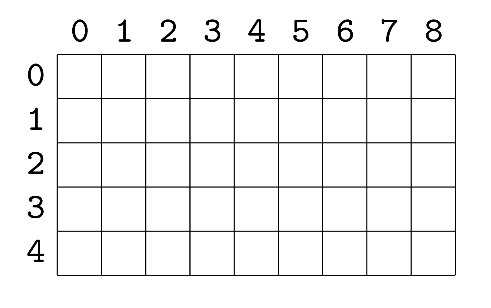

# Data Structures \(Aggregate\)

The common data structure in C are **array** and **struct**, apart from these, there are **enum**, they are held by aggregate variables 

## Array

### One-dimensional Array

* Containing a number of data values \(elements\) of the same type 
* An array of `int` are filled with `0` if some values in the array are initialized
  * example: 

    ```c
    int d[10] = {0}; // all field are filled with 0 
    int a[10] = {[2] = 2, [3] = 3}; // a[2] = 2 and a[3] = 3, others = 0
    ```
* The length of the array may not be declared, just use the length of the list
  * example: 

    ```c
    int c[] = {1,2,3,4};
    ```
* Can access the garbage values outside of the array, the compiler won't check if the index is out of the range 

### Multi-dimensional Array \(Two-dimensional Array\)

* Example: `int a[5][9]`
  * 5 rows and 9 columns, each has type `int`
  * Visualization, and inside the memory




